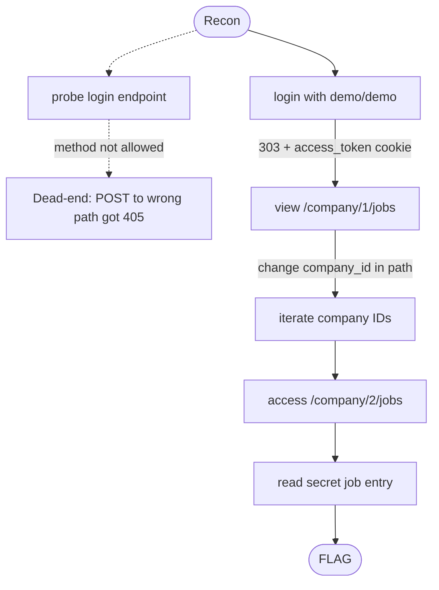

```mermaid
flowchart TD
    Start([Recon])
    probe[probe login endpoint]
    dead405[Dead-end: POST to wrong path got 405]
    auth[login with demo/demo]
    jobs1[view /company/1/jobs]
    idor[iterate company IDs]
    jobs2[access /company/2/jobs]
    read_flag[read secret job entry]
    Flag([FLAG])

    Start -.-> probe
    probe -.->|method not allowed| dead405
    Start --> auth
    auth -->|303 + access_token cookie| jobs1
    jobs1 -->|change company_id in path| idor
    idor --> jobs2
    jobs2 --> read_flag
    read_flag --> Flag
```